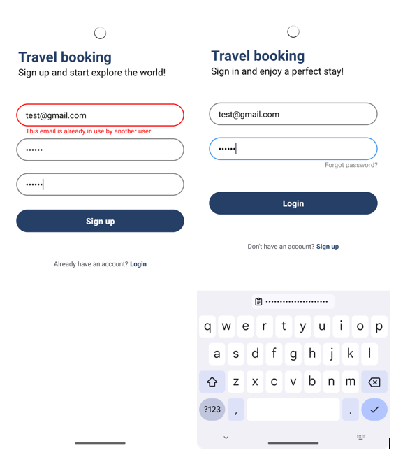
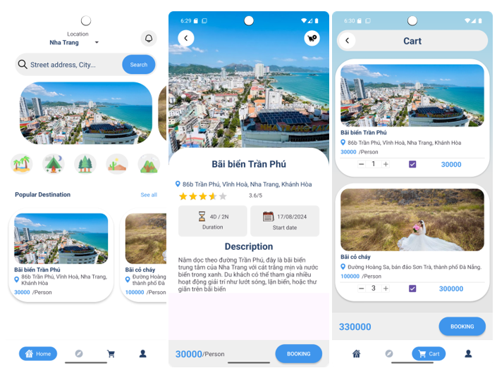
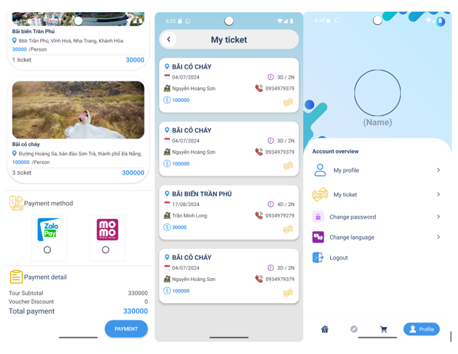
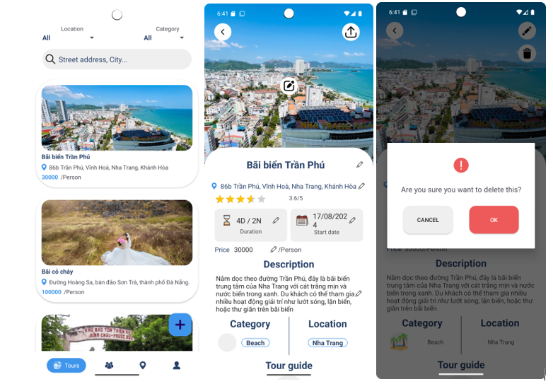

<h1> Tour Booking </h1>
<h2> About this project</h2>
<h3> Project overview</h3>

This app is designed to offer a user-friendly platform that allows users to book tours quickly and effortlessly with just a few taps. Built on the MVVM architecture, it ensures a clean separation of concerns and a responsive interface

(this app should be used for education purpose)

Compatibility: Android 7 and above

You can try it at [here](app-release.apk)

<h3> Features </h3>

**For User**

- User Authentication: Login, Signup, Forgot password
- Tour:

    - Display tours as a list and banner
    - Filter tour list by Location, Category
    - Search tour by name, address,
    - Add tours to the cart

- Cart:

    - Edit number of tickets would be booked
    - Delete tours by swipe to left
    - Book tours of your choice*

*: Payment feature is simulation

- Ticket:
    
    - Display ticket as a list
    - Add tickets by booking tours
    - Delete ticket by swipe to left

- Profile: Logout user

**For admin**

- Manage tours:
 
    - Add a new tour
    - Edit existed tour
    - Delete tour

- Manage users*: Display users as a list, delete user by swipe to left

*: Need to enable server to execute

<h3> Used tech stack </h3>

- MVVM model
- Firebase lib for java
- Glide lib for load image
- Multithreading using CompletableFuture
- Retrofit to send request to server for delete user feature

<h3> Expected features in the future </h3>

- Change personal information
- Integrate payment method
- Permission authentication

<h3> Some screenshot </h3>

<h4> Login, Signup </h4>

<h4> User </h4>

<h4> Admin </h4>

